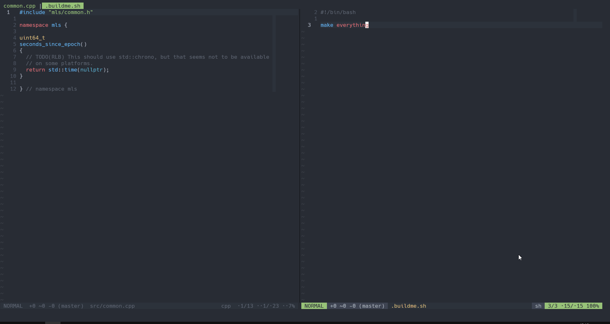

# nvim-buildme

A Neovim plugin to build or run a project using the built-in terminal. It is
very small (~100 SLOC) and written entirely in Lua. See [example](#example)
below for a demo.

## Installation
With [packer.nvim](https://github.com/wbthomason/packer.nvim):
```lua
use {'ojroques/nvim-buildme'}
```

With [paq-nvim](https://github.com/savq/paq-nvim):
```lua
paq {'ojroques/nvim-buildme'}
```

## Usage
The plugin checks for a build file and runs it in a terminal buffer. By default,
this file is a shell script named `.buildme.sh` located in the current working
directory.

If you want your working directory to be automatically set to your project root,
you should check [vim-rooter](https://github.com/airblade/vim-rooter).

To run a build job:
```vim
:BuildMe<CR>
```

To stop a running build job:
```vim
:BuildMeStop<CR>
```

To edit the build file:
```vim
:BuildMeEdit<CR>
```

To jump to the buildme buffer:
```vim
:BuildMeJump<CR>
```

## Configuration
You can pass options to the provided `setup()` function. Here are all available
options with their default settings:
```lua
require('buildme').setup {
  buildfile = '.buildme.sh',  -- the build file to execute
  interpreter = 'bash',       -- the interpreter to use (bash, python, ...)
  wincmd = '',                -- a command to run prior to a build job (split, vsplit, ...)
}
```

## Example


Here the buildfile (in the right window) is a simple shell script with a single
command: `make everything`. Running `:BuildMe` executes this script
asynchronously in a new terminal buffer.

This is particularly useful when your build process is more complex than simply
running `make`, or if you want to run a Python script immediately after editing
it for instance.

## License
[LICENSE](./LICENSE)
